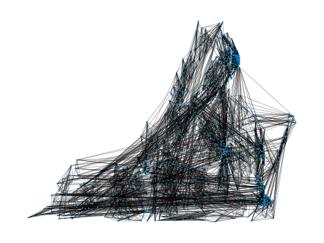
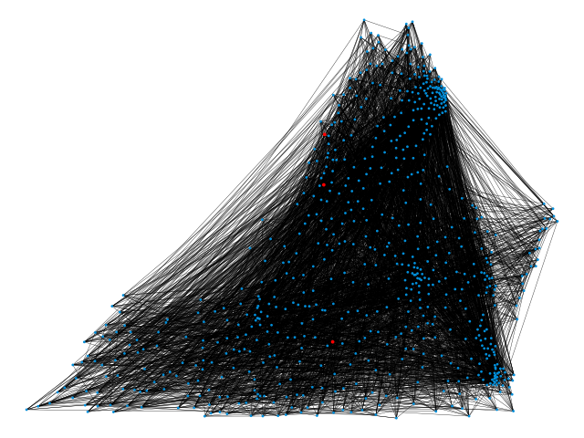
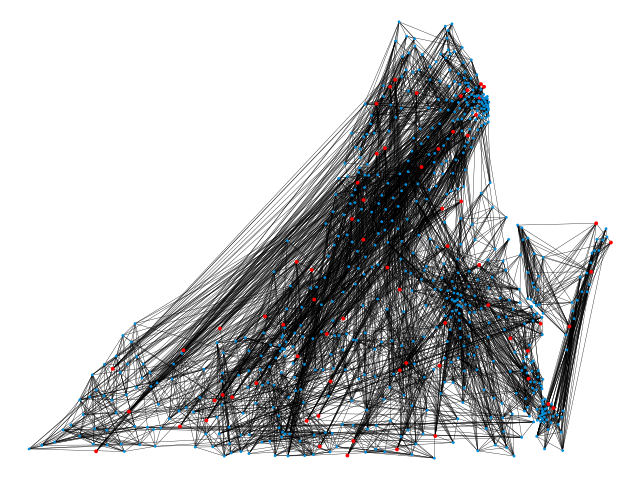
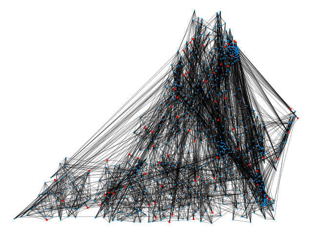
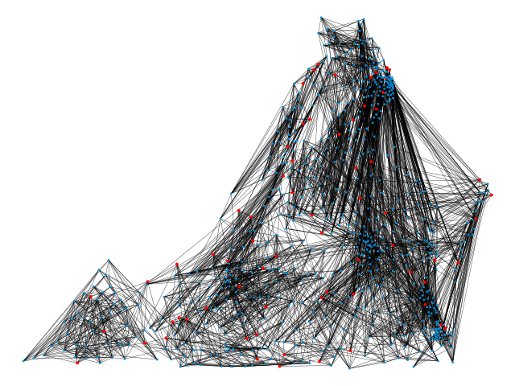
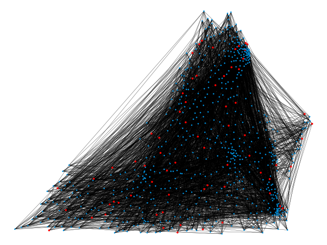
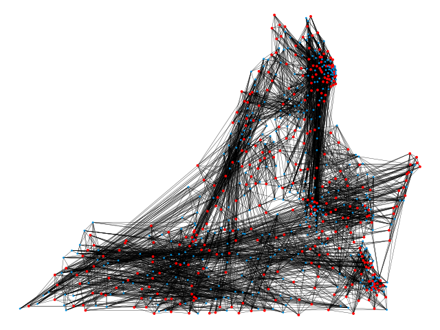
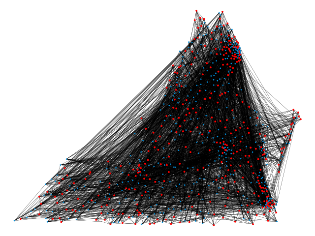

# Geosocial Network Location Inference
This is the code for the forthcoming paper *Your Friends Make You Unique: Location Inference based on Friends’ Locations in Geosocial Networks*.

## Abstract
Geosocial networks serve as a critical bridge between cyber and physical worlds by linking individuals to locations. In many real-world scenarios, both the structure of social networks and the spatial distribution of places are known—yet the connecting information that links people to their specific locations (such as home addresses) is missing. This absence is often intentional, as location constitutes Personally Identifiable Information (PII) and must be protected to ensure user privacy. In this work, we investigate the feasibility of inferring such missing geosocial links by estimating the home locations of users in a social network based solely on network structure and a limited set of known user-location pairs.
We propose and evaluate three novel algorithms for linking social and spatial networks: (i) a greedy assignment algorithm, (ii) a hierarchical approach leveraging the METIS graph partitioning algorithm, and (iii) a spatially-aware adaptation of force-directed graph drawing. Each method is further enhanced to incorporate a small number of known anchor nodes—users with known locations—as commonly available in practical settings. Using anonymized social network data from the Virginia, USA region, our empirical evaluation shows that even a sparse set of anchor points can enable accurate inference of users' home locations. These findings highlight both the potential analytical value and the privacy risks associated with linking social and spatial data, underscoring the need for robust safeguards around location-based PII.

## Algorithms
The three proposed algorithms are included in this repository. The Greedy Algorithm matches nodes to locations that are close to locations of nodes they are connected to. Nodes are processed iteratively in order of degree. The Partitioning Algorithm utilizes METIS, a graph partitioning software, to match communities of nodes to communities of locations. Finally, the Graph Drawing Algorithm utilizes the NetworkX Spring Layout function to generate locations for each node in the social network. Nodes are then matched to the closest available location.

Each algorithm requires an adjacency matrix to represent the social network, a list of coordinates that nodes are matched to, and a dictionary of known locations which maps the ID of a node in the adjacency matrix to a coordinate in the list of locations. If there are no known locations, this dictionary is empty. For each algorithm, a dictionary which maps nodes to locations is returned.

## Experimental Results
| Ground Truth Network for Facebook Location Data| Ground Truth Network for Fairfax Mobility Data|
|:-:|:-:|

The three proposed algorithms were tested on three datasets: Facebook Social Connectedness Data [[1]](#1), Fairfax Mobility Data [[2]](#2), and a Synthetic Geosocial Erdős-Rényi Network [[3]](#3). The social networks and locations for the first two datasets were generated using the code in the folder Datasets. For the Synthetic Geosocial Erdős-Rényi Network, random locations were used and the social network was generated using the code in the [Synthetic Geosocial Networks Repository](https://github.com/KetevanGallagher/Synthetic-Geosocial-Networks). The Ground Truth Networks for the Facebook and Fairfax data are shown in the figure above.

### Facebook Social Connectedness Network
The qualitative results for the Facebook Network are shown in the figure below. As can be seen, the edges in the Graph Drawing Algorithm image become shorter and the graph becomes less dark when compared to the other algorithms as the number of known locations increase. Although the Partitioning Algorithm does not have very many long edges when only a few locations are known, it does not improve as known locations are added. All three algorithms have more whitespace than the Random graph, which has very long edges even with many known locations.

| Known Locations | Greedy Algorithm | Partitioning Algorithm | Graph Drawing Algorithm | Random Algorithm |
|     :---:    |     :---:      |     :---:     |     :---:     |     :---:     |
| 0 |  |  |  |  |
| 3 |  |  |  |  |
| 68 \(10%\) |  |  |  |  |
| 344 \(50%\) |  |  |  |  |

### Fairfax Mobility Network
TODO

### Synthetic Geosocial Erdős-Rényi Network
TODO

## References
<a id="1">[1]</a> 
M. Bailey, R. Cao, T. Kuchler, J. Stroebel, and A. Wong. Social connectedness: Measurement, determinants, and effects. *Journal of Economic Perspectives*, 32(3):259–280, 2018.

<a id="2">[2]</a> 
Y. Kang, S. Gao, Y. Liang, M. Li, J. Rao, and J. Kruse. Multiscale dynamic human mobility flow dataset in the us during the covid-19 epidemic. *Scientific data*, 7(1):390, 2020.

<a id="3">[3]</a> 
K. Gallagher, T. Anderson, A. Crooks, and A. Züfle. Synthetic geosocial network generation. In *Proceedings of the 7th ACM SIGSPATIAL Workshop on Location-based Recommendations, Geosocial Networks and Geoadvertising*, pages 15–24, 2023.
