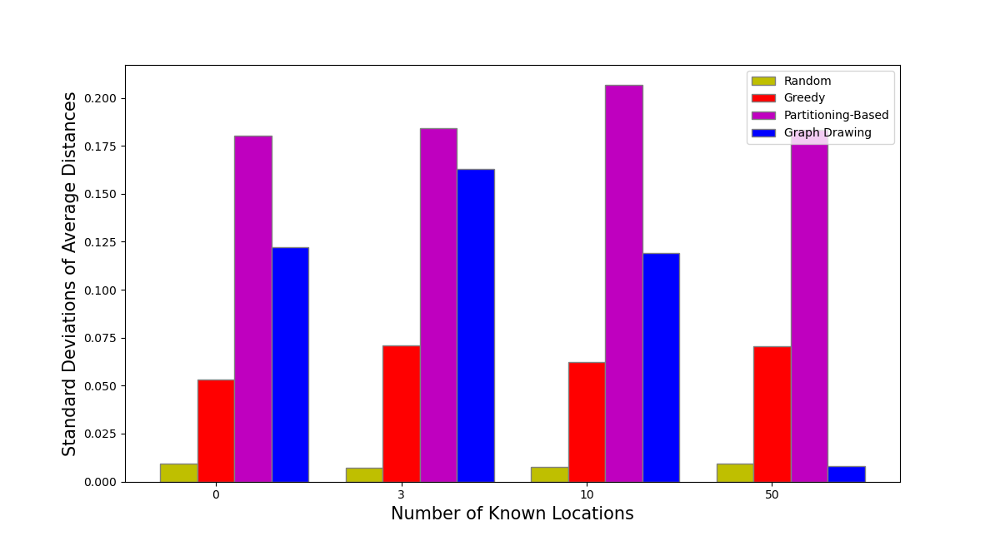

# Geosocial Network Location Estimation
This is the code for the forthcoming paper *Your Friends Reveal Where You Are: Location Estimation based on Friends’ Locations in Geosocial Networks*.

## Abstract
Geosocial networks serve as a critical bridge between cyber and physical worlds by linking individuals to locations. In many realworld scenarios, both the structure of social networks and the spatial distribution of places are known—yet the connecting information that links people to locations is missing. This absence is often intentional to ensure user privacy. In this work, we investigate the feasibility of estimating locations based solely on network structure and a limited set of known user-location pairs. We propose and evaluate three novel algorithms for linking social and spatial networks: (i) a greedy assignment algorithm, (ii) a hierarchical approach using graph partitioning, and (iii) a spatially-aware adaptation of force-directed graph drawing. Each method is further enhanced to incorporate a small number of known anchor vertex—users with known locations. Using anonymized social network data from the Virginia, USA region, our empirical evaluation shows that even a sparse set of anchor points can enable accurate estimation of users’ home locations. These findings highlight both the potential analytical value and the privacy risks associated with linking social and spatial data.

## Algorithms
The three proposed algorithms are included in this repository. The Greedy algorithm matches vertices to locations that are close to the locations of vertices they are connected to. Vertices are processed iteratively in order of degree. The Partitioning-Based algorithm utilizes METIS, a graph partitioning software, to match clusters of vertices to clusters of locations. Finally, the Graph Drawing algorithm utilizes the NetworkX Spring Layout function to generate locations for each vertex in the social network. Vertices are then matched to the closest available location.

Each algorithm requires an adjacency matrix to represent the social network, a list of coordinates that vertices are matched to, and a dictionary of known locations that maps the ID of a vertex in the adjacency matrix to a coordinate in the list of locations. If there are no known locations, this dictionary is empty. Each algorithm returns a dictionary that maps vertices to locations.

## Experimental Results
| Ground Truth Network for Facebook Location Data| Ground Truth Network for Fairfax Mobility Data|
|:-:|:-:|

The three proposed algorithms were tested on three datasets: Facebook Social Connectedness Data [[1]](#1), Fairfax Mobility Data [[2]](#2), and a Synthetic Geosocial Erdős-Rényi Network [[3]](#3). The social networks and locations for the first two datasets were generated using the code in the folder Datasets. For the Synthetic Geosocial Erdős-Rényi Network, random locations were used and the social network was generated using the code in the [Synthetic Geosocial Networks Repository](https://github.com/KetevanGallagher/Synthetic-Geosocial-Networks). The Ground Truth Networks for the Facebook and Fairfax data are shown in the figure above.

Detailed quantitative results, including the average distance between the assigned location and true location, the number of nodes inferred correctly, run time, and the standard deviations of average distances can be found under [ExperimentalResults/QuantitativeResults](ExperimentalResults/QuantitativeResults). These quantitative results are the average of 30 trials. The standard deviations displayed are calculated from the 30 trials.

### Facebook Social Connectedness Network
The qualitative results for the Facebook Network are shown in the figure below. In each figure, the estimated location and true location for each vertex are connected. Vertices with known locations are colored red. As can be seen, the links in the Graph Drawing algorithm image become shorter and the graph becomes less dark when compared to the other algorithms as the number of known locations increases. In particular, the figure for the Graph Drawing algorithm with 481 known locations has very few long links even when compared to other algorithms with 481 known locations. Although the Partitioning-Based algorithm does not have very many long links when only a few locations are known, as can be seen in the example with three known locations, it does not improve as known locations are added. All three algorithms have more whitespace than the random graph, which has very long links even with many known locations.

| Known Locations |Random Algorithm | Greedy Algorithm | Partitioning-Based Algorithm | Graph Drawing Algorithm | 
|     :---:    |     :---:      |     :---:     |     :---:     |     :---:     |
| 0 |  |  |  |  |
| 3 |  |  |  |  |
| 68 \(10%\) |  |  |  |  |
| 344 \(50%\) |  |  |  |  |

Quantitative results for the Facebook Network are displayed below. The first chart shows the average distance from the assigned location of each vertex to its true location. An overall decreasing trend can be observed for each algorithm as the number of known locations increases. The Graph Drawing algorithm decreases most rapidly as known locations increase but all algorithms consistently perform better than the random baseline. For the Partitioning-Based algorithm, the number of known locations does not greatly affect the outcome. This can also be observed in the number of vertices inferred correctly. While the Partitioning-Based algorithm can match many vertices to their correct location when compared to the other algorithms for a small number of known locations, the number of additional vertices inferred correctly does not increase greatly with a higher number of known locations. However, for the Graph Drawing algorithm, as the number of known locations increases, so does the number of additional vertices inferred correctly when compared to the other three algorithms.

Average Distance to True Location | Number of Vertices Inferred Correctly | 
|     :---:    |     :---:      |
|||

The standard deviation of the average distances for the Greedy and Partitioning-Based algorithms is higher than that for the random baseline and the Graph Drawing algorithm for all trials with known locations. The Greedy is deterministic, so when there are no known locations, it has a standard deviation of zero. For the Facebook dataset, nodes were not randomized before being partitioned, leading to a standard deviation of zero for the Partitioning-Based algorithm when no known locations are used. For the Greedy algorithm, if the starting vertex is inferred incorrectly, the error increases as more vertices are inferred incorrectly. However, this only happens in some cases, thus causing a high standard deviation. For the Partitioning-Based algorithm, if clusters are matched incorrectly, this can lead to large errors later on. When clusters are matched correctly, average distances are low. This results in a high standard deviation for this algorithm. The random baseline has the lowest standard deviation, which is expected. The standard deviation for the Graph Drawing algorithm decreases as the number of known locations increases. For example, for 344 known locations, the standard deviations of the Partitioning-Based and Greedy algorithms are over ten times that of the Graph Drawing algorithm.

| Standard Deviation of Average Distances |
|     :---:      |
||

### Fairfax Mobility Network

This table shows the qualitative results for the Fairfax Mobility Data, averaged over 30 trials. The results for the Fairfax Mobility data show similar patterns to that of the Facebook Location data. For the Partitioning-Based algorithm with 24 known locations, areas can be seen where clusters were matched correctly but individual vertices within the cluster were matched incorrectly. For the Graph Drawing figure with zero known locations, long links on the peripheries of the graph are observed because there are no known locations that can be used to attract vertices to the correct location.

| Known Locations | Random Algorithm | Greedy Algorithm | Partitioning-Based Algorithm | Graph Drawing Algorithm |
|     :---:    |     :---:      |     :---:     |     :---:     |     :---:     |
| 0 |  |  |  |  |
| 3 |  |  |  |  |
| 24 \(10%\) |  |  |  |  |
| 121 \(50%\) |  |  |  |  |

The following figures show quantitative results for Fairfax Mobility Network, averaged over 30 trials. Similar patterns to those seen in results generated by the Facebook dataset are observed in the chart which displays average distances, including that the Graph Drawing algorithm improves most rapidly when compared to the other algorithms. While the Greedy algorithm outperforms the Graph Drawing algorithm in the number of vertices inferred correctly for 169 and 121 known locations, the Graph Drawing algorithm has a shorter average distance to the true location for both of these levels of known locations. This pattern can also be seen in the qualitative results, as the figures for the Greedy algorithm often have long links across the graph where vertices were matched far from their true location.

Average Distance to True Location | Number of Vertices Inferred Correctly | 
|     :---:    |     :---:      |
|||

The chart below displays the standard deviation of the average distance for each algorithm. Similarly to results for the Facebook dataset, the random baseline consistently has the lowest standard deviation. It can also be observed that the standard deviation of the Graph Drawing algorithm decreases more rapidly than the other algorithms as the number of known locations increases.

| Standard Deviation of Average Distances |
|     :---:      |
||

### Synthetic Geosocial Erdős-Rényi Network

The following table shows qualitative results for the Geosocial Erdős-Rényi Network with all algorithms. Each figure was generated using the same set of 1,000 random locations and the same Geosocial network, but different levels of known locations were used. Similarly to the real-world datasets, the Graph Drawing algorithm improves greatly as more known locations are added. In fact, the figure for the Graph Drawing algorithm with 50 known locations has the most whitespace out of any of the Erdős-Rényi figures. The random baseline is also observed to have many long links and uniform errors, as expected.

| Known Locations | Random Algorithm | Greedy Algorithm | Partitioning-Based Algorithm | Graph Drawing Algorithm |
|     :---:    |     :---:      |     :---:     |     :---:     |     :---:     |
| 0 |  |  |  |  |
| 3 |  |  |  |  |
| 10 |  |  |  |  |
| 50 |  |  |  |  |

Quantitative results, averaged over 30 trials, for the Geosocial Erdős-Rényi Network are shown below. For each trial, random locations were used and a new geosocial network was generated every time. Additionally, new random known locations were used for each trial. The charts below were generated using a population of 1,000 vertices. Charts and results for populations of 100 and 500 vertices can be found under [ExperimentalResults/QuantitativeResults](ExperimentalResults/QuantitativeResults).

We see that for each level of known locations, the Graph Drawing algorithm has the best average distance out of all the algorithms. For 50 known locations, the average distance of the Graph Drawing algorithm is less than half of the average distances of all other algorithms. In the chart that displays the number of vertices inferred correctly for each algorithm, it can be observed that while the Partitioning-Based algorithm has the highest number correct initially, as the number of known locations increases, the number of vertices matched correctly rapidly increases for the Graph Drawing algorithm, leading to it have the highest number correct for the trials with 50 known locations. 

Average Distance to True Location | Number of Vertices Inferred Correctly | 
|     :---:    |     :---:      |
|||

Similarly to the real-world datasets, the standard deviations for the Greedy algorithm, Partitioning-Based algorithm, and random baseline do not change drastically as the number of known locations increases. However, the standard deviations for the Graph Drawing algorithms do decrease, especially between 10 and 50 known locations. For all datasets, as the number of known locations increases, the Graph Drawing algorithm is not only to match vertices closer to their true locations but there is less variation in its outcomes.

| Standard Deviation of Average Distances |
|     :---:      |
||

### Run Times
The chart below displays the run times for each algorithm in seconds with a log scale on the y-axis. This chart displays the run time for all algorithms and a random baseline for five different populations: (1) The Facebook dataset, which has a population of 688. (2) The Fairfax dataset, which has a population of 242. (3) Three Erdős-Rényi datasets, with a population of 100, 500, and 1,000. These runtimes were averaged over 30 trials and all known locations for each dataset. The random baseline and Greedy algorithm have a similar runtime that varies directly with the size of the population. The Partitioning-Based algorithm has a much higher runtime than the other algorithms as it must consider combinations of location and social network clusters. Although the Graph Drawing algorithm is slower than the Greedy algorithm, it is faster than the Partitioning-Based algorithm and yields shorter distances between the assigned location and the true location as seen previously.

## References
<a id="1">[1]</a> 
M. Bailey, R. Cao, T. Kuchler, J. Stroebel, and A. Wong. Social connectedness: Measurement, determinants, and effects. *Journal of Economic Perspectives*, 32(3):259–280, 2018.

<a id="2">[2]</a> 
Y. Kang, S. Gao, Y. Liang, M. Li, J. Rao, and J. Kruse. Multiscale dynamic human mobility flow dataset in the us during the covid-19 epidemic. *Scientific data*, 7(1):390, 2020.

<a id="3">[3]</a> 
K. Gallagher, T. Anderson, A. Crooks, and A. Züfle. Synthetic geosocial network generation. In *Proceedings of the 7th ACM SIGSPATIAL Workshop on Location-based Recommendations, Geosocial Networks and Geoadvertising*, pages 15–24, 2023.
